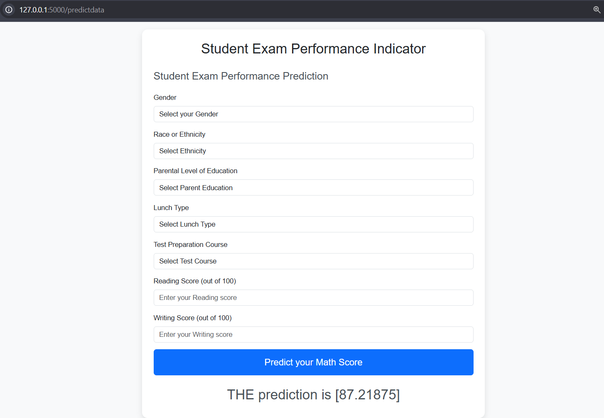

# Student Exam Performance Predictor

This project is a **Student Exam Performance Predictor**, built using **Machine Learning (ML)** and the **Flask framework**. It predicts the **math score** of a student based on various input parameters, such as gender, race/ethnicity, parental level of education, lunch type, test preparation course, reading score, and writing score.

---

## Table of Contents
- [Project Overview](#project-overview)
- [Features](#features)
- [Technologies Used](#technologies-used)
- [Setup Instructions](#setup-instructions)
- [How It Works](#how-it-works)
- [Demo](#demo)

---

## Project Overview
The **Student Exam Performance Predictor** provides an intuitive web interface for users to input student-related details and predict the expected math score using a pre-trained Machine Learning model. The application showcases how ML can be integrated with Flask to deliver actionable insights via a user-friendly interface.

---

## Features
- User-friendly web interface to input student data.
- Predicts math scores based on reading and writing scores and other demographic information.
- Built-in validation for numerical inputs.
- Real-time prediction results displayed on the web page.

---

## Technologies Used
- **Backend**: Flask (Python)
- **Machine Learning**: Scikit-learn
- **Frontend**: HTML, CSS, JavaScript (Bootstrap framework)
- **Deployment**: Flask's development server (for local use)

---

## Setup Instructions

### Prerequisites
1. Python 3.7+
2. pip (Python package installer)

### Steps
1. Clone this repository:
   ```bash
   git clone https://github.com/your-username/student-exam-predictor.git
   cd student-exam-predictor
   ```

2. Install the required Python packages:
   ```bash
   pip install -r requirements.txt
   ```

3. Run the Flask application:
   ```bash
   python app.py
   ```

4. Open your web browser and navigate to:
   ```
   http://127.0.0.1:5000/predictdata
   ```

5. Enter the student data into the form and click on the **Predict your Math Score** button to see the result.

---

## How It Works
1. **Input Form**: Users input student data such as gender, ethnicity, parental education, etc.
2. **Backend Processing**: The Flask backend validates the input data and sends it to the pre-trained ML model.
3. **ML Model Prediction**: The model predicts the math score based on the input data.
4. **Result Display**: The predicted math score is displayed on the web interface.

---

## Demo
Below is a screenshot of the application in action:



## Contributing
Contributions are welcome! Please feel free to fork this repository and submit a pull request.

---

## License
This project is licensed under the MIT License. See the [LICENSE](LICENSE) file for details.
